<h1 align="center">Hi 👋, I'm Henry Chen</h1>

<h3 align="center">A passionate developer from Ottawa, Canada!</h3>

- 😄 Pronouns: He/Him
  
- 🎓 Currently a second-year student studying Computer Science at the University of Toronto
  
- 👀 I’m interested in developing software that will change the world!

- 🔧 Skills in Java, Python, PHP, HTML & CSS, Javascipt, Git, cPanel, TensorFlow
  
- 🎲 Life long hobby of playing Go, contact me to play a game

- 📄 Know about my experiences [LinkedIn](https://www.linkedin.com/in/henry-tj-chen/)

- 🌐 Check out my [Website](https://henrytchen.com/)
  
- 📫 Feel free to reach out to me: [**henryt(dot)chen(at)mail(dot)utoronto(dot)ca**](mailto://henryt.chen@mail.utoronto.ca)

&nbsp;

<!---
LatinScribe/LatinScribe is a ✨ special ✨ repository because its `README.md` (this file) appears on your GitHub profile.
You can click the Preview link to take a look at your changes.
--->
