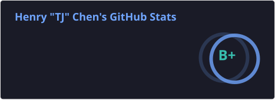
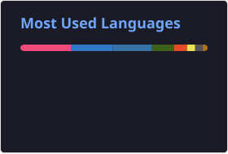

<h1 align="center">Hi 👋, I'm Henry Chen</h1>

<h3 align="center">A passionate developer from Ottawa, Canada!</h3>

- 😄 Pronouns: He/Him
  
- 🎓 Recent Graduate in Computer Science from the University of Toronto

- 🛡️ Ex Microarchitectural security researcher in the Secure Intelligent and Trustworthy Systems (SITH) lab at U of T
  
- 👀 I’m interested in developing software that will change the world!

- 🔧 Skills in Java, Python, C/UNIX, PHP/HTML/CSS, Javascipt, Assembly, React, Node & Next.js, TypeScript, Tailwind CSS, Restful APIs, Data Structures & Algorithms, Docker, Git, cPanel
  
- 🎲 Life long hobby of playing [Go](https://en.wikipedia.org/wiki/Go_(game)), contact me to play a game!

- 📄 Know about my experiences [LinkedIn](https://www.linkedin.com/in/henry-tj-chen/)

- 🌐 Check out my [Website](https://henrytchen.com/)
  
- 📫 Feel free to reach out to me: [**henryt [dot] chen [at] mail [dot] utoronto [dot] ca**](mailto://henryt.chen@mail.utoronto.ca)

<!---
LatinScribe/LatinScribe is a ✨ special ✨ repository because its `README.md` (this file) appears on your GitHub profile.
You can click the Preview link to take a look at your changes.
--->
